<!--
**luigalve/luigalve** is a ✨ _special_ ✨ repository because its `README.md` (this file) appears on your GitHub profile.

Here are some ideas to get you started:

  

  

  

- 🔭 I’m currently working on ...
- 🌱 I’m currently learning ...
- 👯 I’m looking to collaborate on ...
- 🤔 I’m looking for help with ...
- 💬 Ask me about ...
- 📫 How to reach me: ...
- 😄 Pronouns: ...
- ⚡ Fun fact: ...
-->
<!-- Profile README. Everything in [brackets] is a placeholder to fill in.
     This file lives in a public repo named EXACTLY the same as your username.
     That is what makes it render on your profile page.
     House style: no em dashes, no emoji, no badges. -->

  
  

I learn by building. 

<!-- Optional: a two-line Spanish version of the intro can go here. -->
The live tools below are free, single-file apps I built that run in the browser as GitHub Pages. 
No installs, no logins and works offline by downloading the `index.html` source file from the app's repo. 
 

All applications are under active development. Known bugs are listed where they exist.
 
 
 

## Most Recent

Offline study reference I packed with AZ-104 notes while working through the exam objectives. 
_Pick a domain, read the notes, and modify them however you like._
 
 

| App Repository | Live Link | What it covers | Download |
| --- | --- | --- | --- |
| [AZ-104 Reference](https://github.com/luigalve/az104-reference) | [Try the app](https://luigalve.github.io/az104-reference/) | All 38 Azure services on the AZ-104 exam in one searchable, filterable cheat sheet, including the exact commands an administrator actually uses. | [View the source file](https://github.com/luigalve/az104-reference/blob/main/index.html) |

 
Made for my own studying but built to be used and modified by anyone preparing for the exam.
 

Meant to allow users to focus on the course and augment, NOT REPLACE, any study material. Reference this app to reindorce what you cover. 

 
 

## Walkthrough Apps

Step-by-step apps for IT projects I completed on real hardware. 
_Tick the actions, complete the step, watch it turn green._
 
 

| App Repository | Live Link | What it covers | Source |
| --- | --- | --- | --- |
| [Proxmox install on an Old PC](https://github.com/luigalve/proxmox-old-pc) | [Try the app](https://luigalve.github.io/proxmox-old-pc/) | 7 steps. Takes a BIOS-only desktop out of retirement and turns it into a running Proxmox server, including every way the hardware fought back and every fix that worked. | [View the source file](https://github.com/luigalve/proxmox-old-pc/blob/main/index.html) |
| [Build Your Own Walkthrough App](https://github.com/luigalve/build-your-own-walkthrough) | [Try the app](https://luigalve.github.io/build-your-own-walkthrough/) | 11 steps. Teaches someone with zero coding experience to build a walkthrough app like the one above for their own project. | [View the source file](https://github.com/luigalve/build-your-own-walkthrough/blob/main/index.html) |

 
Built for anyone who has ever gotten lost or overwhelmed halfway through a long guide. 
 
 

## Utility Apps

Small tools that each solve one specific problem. 

| App Repository | Live Link | What it Does | Download |
| --- | --- | --- | --- |
| [DensePack](https://github.com/luigalve/DensePack) | [Try the app](https://luigalve.github.io/DensePack/) | Converts pasted text into the smallest AI-readable PNG, cutting input token cost by feeding long documents to vision models as image instead or raw text. | [View the source file](https://github.com/luigalve/DensePack/blob/main/index.html) |
| [Foundry Studio](https://github.com/luigalve/) | [Try the app](https://luigalve.github.io//) | SVG design studio in a single file. Multi-canvas, shape blending with SVG masks, rotation, and animation presets. Create your own Github README animations. | [View the source file](https://github.com/luigalve//blob/main/index.html) |
 

### Known Issues

DensePack:
 
Readability drops when AI providers resize large images. Color coding added. Additional fix in progress. 
 
FoundryStudio:
  
Exported SVGs do not render cleanly on mobile. Fix in progress.
 
 
 

## On the Bench

Built, working, and on the way.  

| Project | Status | Summary |
| --- | --- | --- |
| Windows Server Home Lab | Docs queued | Small-business network on a repurposed desktop: domain controller, Group Policy, automatic updates, shared storage, remote desktops, and Entra hybrid sync. Over 10 manually configured server roles. |
| Home Network Security | Docs queued | Segmented home network with VLANs for IoT and guests, ad and tracker blocking, and a VPN kill switch for selected devices. Publishing as a reference architecture with sanitized configs. |
| Excel Column Aggregator | Published, app and source coming | Desktop tool that pulls chosen columns from many Excel workbooks into one master file. Built in two weeks for a manufacturing QA team; runs daily in production with zero support tickets. |
| 3D Printer From Salvage | Build log coming | A working 3D printer built from stepper motors harvested from dead office printers, driven by a $5 ESP32. Slow, cheap, and highly educational. |
 
 

## Certifications

- CompTIA A+
- Google IT Support Professional Certificate
- Microsoft Certified: Azure Administrator (AZ-104): in progress

 

<!-- ## Contact

[LinkedIn]([profile link]) &middot; [email]
-->
